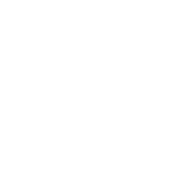

    
    <h3>A Discord application that aims to bridge the gap between using Discord and Campus Lab's Engage platform to better help university clubs manage their organizations.</h3>
    

README is under construction!

This is a blank project for CDK development with Go.

The `cdk.json` file tells the CDK toolkit how to execute your app.

## Useful commands

 * `cdk deploy`      deploy this stack to your default AWS account/region
 * `cdk diff`        compare deployed stack with current state
 * `cdk synth`       emits the synthesized CloudFormation template
 * `go test`         run unit tests
